# Procesverslag
Markdown is een simpele manier om HTML te schrijven.  
Markdown cheat cheet: [Hulp bij het schrijven van Markdown](https://github.com/adam-p/markdown-here/wiki/Markdown-Cheatsheet).

Nb. De standaardstructuur en de spartaanse opmaak van de README.md zijn helemaal prima. Het gaat om de inhoud van je procesverslag. Besteedt de tijd voor pracht en praal aan je website.

Nb. Door *open* toe te voegen aan een *details* element kun je deze standaard open zetten. Fijn om dat steeds voor de relevante stuk(ken) te doen.

## Jij

uitwerken voor kick-off werkgroep

### Auteur:
Kaj van Duijn
 
#### Je startniveau:
Blauw
 
#### Je focus:
Minder Divs gebruiken, meer met flexbox spelen ipv grids en beter met media query's kunnen werken 

## Je website

uitwerken voor kick-off werkgroep

### Je opdracht:
#### Ik ga de website van finntheduck.com uitwerken, deze is in shopfy gemaakt en maakt het voor mij dus extra een uitdaging om het goed in html en css na te maken. 

#### Screenshot(s) van de eerste pagina (small screen): 
Home pagina van finntheduck.com

#### Screenshot(s) van de tweede pagina (small screen):
#### Contact pagina van finntheduck.com
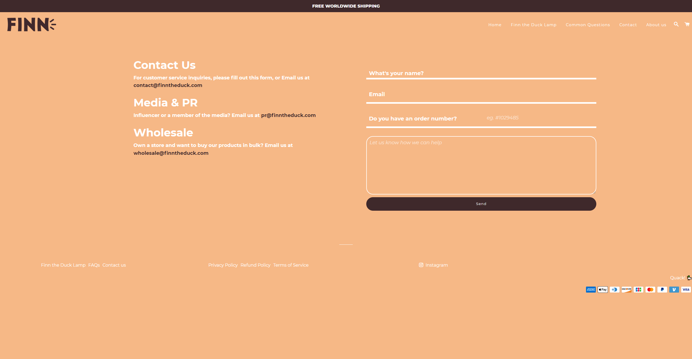
 

## Breakdownschets (week 1)

uitwerken na afloop 2e werkgroep

### de hele eerste pagina: 
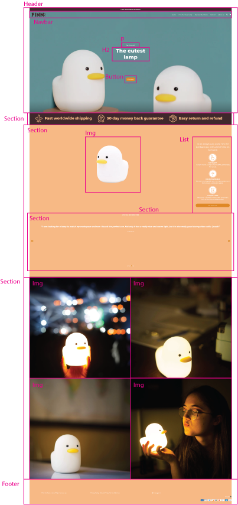

### dynamisch deel (bijv menu): 
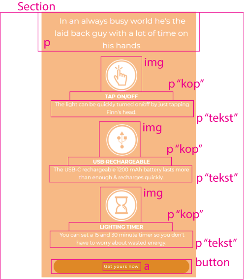

### wellicht nog een dynamisch deel (bijv filter): 
 
 ### de hele tweede pagina: 
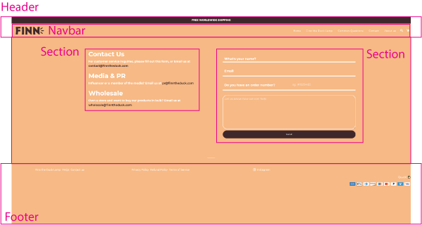

## Voortgang 1 (week 2)

Iphone SE versie deels uitgewerkt voor beide pagina's

### Stand van zaken
De eerste pagina van de iphone 5 / se maken ging makkelijk en snel,had alleen wat moeite met de afbeeldingen die de orginele website gebruikt te verkrijgen.
Het moeilijkste was om de instagram feed goed te krijgen, dit gebruikt namelijk een 2x2 grid met 4 afbeeldingen. Ik heb dat nog nooit gedaan maar na een aantal dingen proberen met width en height was het snel opgelost. 

 

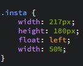

 In de eerste week was dus al de eerste pagina zo goed als af, samen met de styling.

### Agenda voor meeting
samen met je groepje opstellen

| student 1      | student 2          | student 3    | student 4        |
| ---            | ---                | ---          | ---              |
| dit bespreken  | en dit             | en ik dit    | en dan ik dat    |
| en dat ook nog | dit als er tijd is | nog een punt | dit wil ik zeker |
| ...            | ...                | ...          | ...              |

### Verslag van meeting
hier na afloop snel de uitkomsten van de meeting vastleggen

- Hoe met media-query's werken? min-width of max-width gebruiken? -> min-width
- punt 2
- nog een punt
- ...

## Voortgang 2 (week 3)

Iphone SE versie voor beide pagina's zijn klaar

### Stand van zaken
In de derde week heb ik al zo goed als alles uitgewerkt wat "makkelijk" te maken is op een website, nu moet ik nog een carousel toevoegen voor de quotes om aan mijn Javascript microinteractie te voldoen en met media query's alles goed krijgen zodat het responsive is.
Ik heb niet echt problemen gehad tot nu toe, het was even weer lastig met het formulier omdat ik dat nooit gebruik, maar na even puzzelen ben ik er wel uit gekomen. 

### Agenda voor meeting
samen met je groepje opstellen

| student 1      | student 2          | student 3    | student 4        |
| ---            | ---                | ---          | ---              |
| dit bespreken  | en dit             | en ik dit    | en dan ik dat    |
| en dat ook nog | dit als er tijd is | nog een punt | dit wil ik zeker |
| ...            | ...                | ...          | ...              |

### Verslag van meeting
hier na afloop snel de uitkomsten van de meeting vastleggen

- punt 1
- punt 2
- nog een punt
- ...

## Toegankelijkheidstest (week 4)

uitwerken na test in 8e voortgang

### Bevindingen met oud klasgenoten 
 
Bij 1024px en 1920px breedte is het menu nog steeds een hamburger, dit kan beter veranderd worden naar een "normaal" menu. 

De specificaties blijven onder elkaar staan bij het grote scherm, dit kan ook naast elkaar zodat het in een keer te zien is.
 
De shipping en retour informatie in het bruine vlak kan ook in plaats van onder elkaar naast elkaar als een soort banner. 
 
Alt tekst toevoegen voor de afbeeldingen
 
Linkjes naar paginas toevoegen, nu zijn er twee schermen maar geen verbindingen tussen de twee. 

 
 
 
 
 
#### Titel eerste bevinding
Bij 1024px en 1920px breedte is het menu nog steeds een hamburger, dit kan beter veranderd worden naar een "normaal" menu.

 Ik kan hier beter een normaal menu hebben zodat de gebruiker alle mogelijkheden direct ziet. 

 
 
 
 
 
#### Titel tweede bevinding. 
De specificaties blijven onder elkaar staan bij het grote scherm, dit kan ook naast elkaar zodat het in een keer te zien is. 

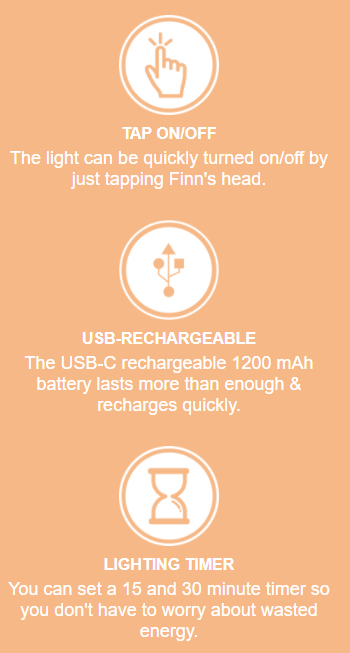
 
 
Ik kan de specs ipv centeren naast elkaar zetten zodat ze alle drie tegelijk te zien zijn.

 
 
 
 
#### Titel volgende bevinding. 
De shipping en retour informatie in het bruine vlak kan ook in plaats van onder elkaar naast elkaar als een soort banner.
 
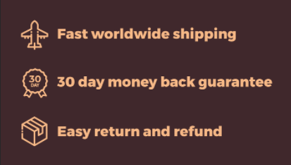

Ik kan een andere afbeelding op deze plek zetten die horizontaal informatie deelt ipv verticaal (met indien nodig een afbeelding)

#### Titel nog een bevinding. 
Linkjes naar paginas toevoegen, nu zijn er twee schermen maar geen verbindingen tussen de twee.

href invullen bij de <a> zodat er links zijn tussen de pagina's
 

## Voortgang 3 (week 4)

Ik heb de website voor beide pagina's responsive gemaakt, JS toegevoegd door middel van een carousel en alle bevindingen aangepast die we vorige week hadden bevonden.

### Stand van zaken
Ik heb nu alle bevindingen opgelost, ook heb ik het javascript gedeelte erin kunnen krijgen en alles responsive kunnen maken. Het javascript was niet al te moeilijk omdat ik Frontend for Designers heb gevolgd en daar veel met Sanne aan Javascript moest werken. De carousel was hier niet echt een uitdaging door omdat dit simpele functions waren. 

### Agenda voor meeting
samen met je groepje opstellen

| student 1      | student 2          | student 3    | student 4        |
| ---            | ---                | ---          | ---              |
| dit bespreken  | en dit             | en ik dit    | en dan ik dat    |
| en dat ook nog | dit als er tijd is | nog een punt | dit wil ik zeker |
| ...            | ...                | ...          | ...              |

### Verslag van meeting
hier na afloop snel de uitkomsten van de meeting vastleggen

- punt 1
- punt 2
- nog een punt
- ...

## Eindgesprek (week 5)

Ik was hier eigenlijk al zo goed als klaar voor, maandag 4 oktober heb ik nog even wat code opgeschoond en de laatste beetjes commentaar toegevoegd

### Stand van zaken
hier dit ging goed & dit was lastig (neem ook screenshots op van delen van je website en code)

### Screenshot(s)

 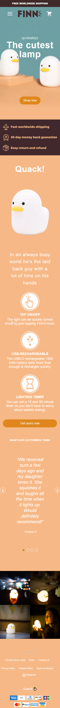

 
 
  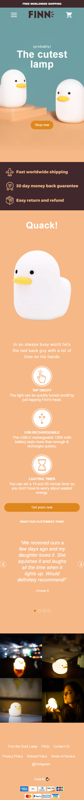

 
 
  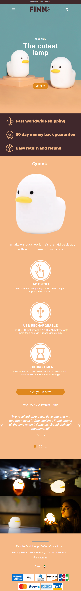

 
  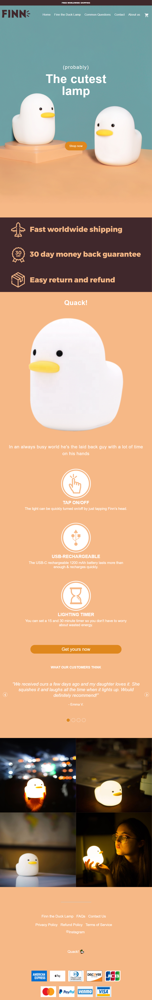

 
 
  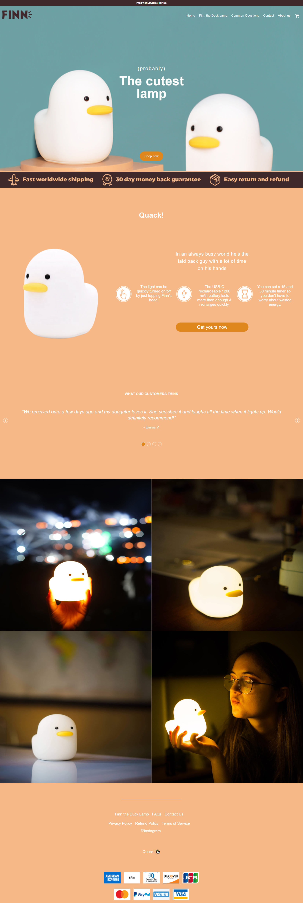

 
 
 
 
 
 
 
 
 
 
 
 
 
 
 
 
 
 ## Je website

uitwerken voor kick-off werkgroep

### Je opdracht:
#### Ik ga de website van Spotify uitwerken, deze is in shopfy gemaakt en maakt het voor mij dus extra een uitdaging om het goed in html en css na te maken. Spotify is een muziek applicatie waarbij nummers gestreamed worden. Spotify maakt gebruik van meerdere abonnementen om altijd iets te kunnen vinden bij hun klanten.

#### Screenshot(s) van de eerste pagina (small screen): 
Home pagina van Spotify, waar je een account kan maken en de spotify applicatie kan opstarten en downloaden.

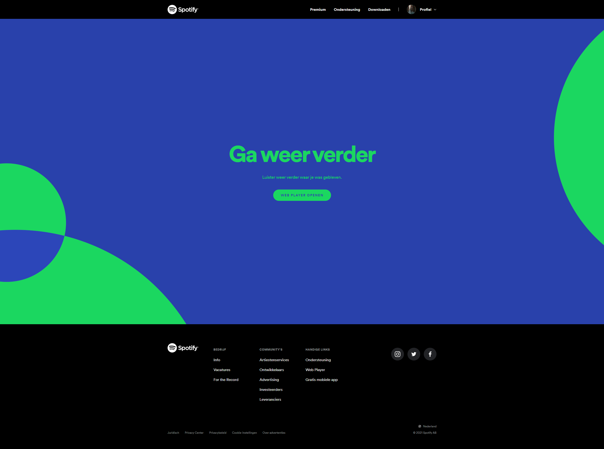

#### Screenshot(s) van de tweede pagina (small screen):
#### Premium pagina van Spotify, waar alle soorten abonnementen van hun staan met beschrijving aan features en kosten.
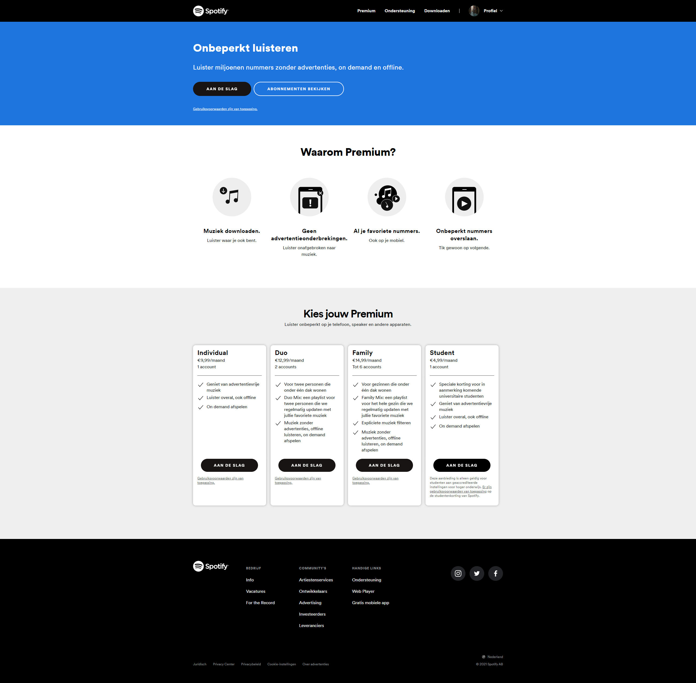
 

 
 
 
 
 
 
 ## Breakdownschets (week 6)

...

### de hele eerste pagina: 

### dynamisch deel (bijv menu): 

### wellicht nog een dynamisch deel (bijv filter): 
 
 ### de hele tweede pagina: 

## Voortgang 1 (week 7)

 Ik heb alle stof nog eens doorgenomen en zowel de eerste als de tweede pagina afgemaakt

### Stand van zaken
De eerste 2 dagen heb ik alle stof nog eens doorgenomen die online stond, ik heb geleerd wat je met flexbox kan doen en hoe je het goed kunt gebruiken. Verder heb ik vooral geprobeerd alles zo goed mogelijk te maken zoals op de echte Spotify website. Deze week heb ik ook aan Vasilis gevraagd of het mogelijk is om een feedback gesprek te houden de volgende week waar ik ga kijken of mijn "basis" code al goed genoeg is.

 

 
 
 ## Voortgang 1 (week 8)

Deze week heb ik een feedback gesprek met Vasilis en maak ik de website verder af.

### Stand van zaken
Woensdag van deze week heb ik het feedback gesprek met Vasilis, ik had moeite met wachten dus toen het feedback gesprek er was had ik ook al vast de eerste pagina responsive gemaakt. Toen het feedbackgesprek er was heb ik de website laten zien via Github pages en heb ik de volgende feedback gekregen: 
- Hover state moet gestijld worden
- Classes kunnen verminderd worden
- nth-of-type gebruiken, dus: nav li a:nth-of-type(2)
- 2de pagina een class geven is logisch
- Vanaf het begin netjes werken
- Commentaar toevoegen
 
 Direct na de feedback heb ik alle classes die ik kon veranderen met nth-of-type meteen veranderd. Dit zorgde voor minder onduidelijkheid en zorgde voor structuur in het css document. De dag erop ben ik begonnen met het responsive maken van de 2de pagina. Dit was binnen een uurtje of twee gedaan zonder al te veel moeilijkheden. De laatste dag van de week begon ik met de hover states toevoegen, dit was ook snel gedaan. 
 
Ik heb er voor geprobeerd te zorgen dat wanneer er over de button van een van de 4 keuzes uit abonnementen werd gehovered dat de container daarvan een groene gloed kreeg in plaats van de normale zwarte schaduw. Dit lukte mij echter niet. 
 
 https://stackoverflow.com/questions/6910049/on-a-css-hover-event-can-i-change-another-divs-styling
 
 Ik heb hier veel naar gezocht en alles komt ongeveer neer op op wat er in de bovenstaande link word gezegd. Om een of andere reden wilt dit bij mij niet lukken, waardoor ik het heb laten vallen. 

 

 In de eerste week was dus al de eerste pagina zo goed als af, samen met de styling.

 
 
 
 ## Voortgang 1 (week 9)

...

### Stand van zaken
...

 In de eerste week was dus al de eerste pagina zo goed als af, samen met de styling.

 
 
 
 ## Eindgesprek (week 10)

...

### Stand van zaken
hier dit ging goed & dit was lastig (neem ook screenshots op van delen van je website en code)

### Screenshot(s)

 

 
 
  

 
 
  

 
  

 
 
  

 
 
 
 
 
 
 
 
 
 

## Bronnenlijst

continu bijhouden terwijl je werkt

Nb. Wees specifiek ('css-tricks' als bron is bijv. niet specifiek genoeg).

1. Carousel, deels van Frontend for Designers 
2. Sidebar navigatie deels https://youtu.be/MxW0dv5W7Ds 
3. Afbeeldingen - Finntheduck.com

